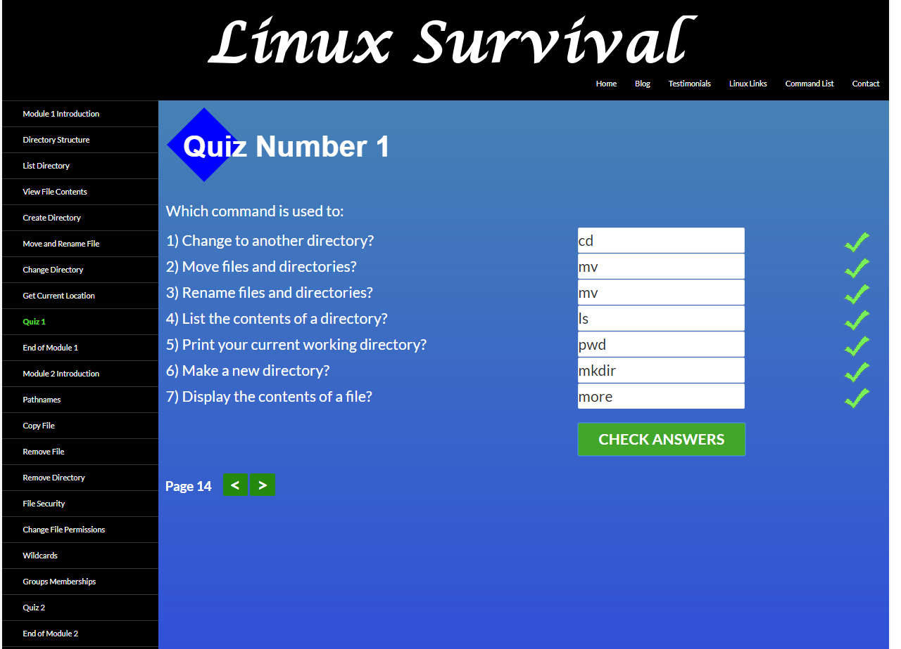
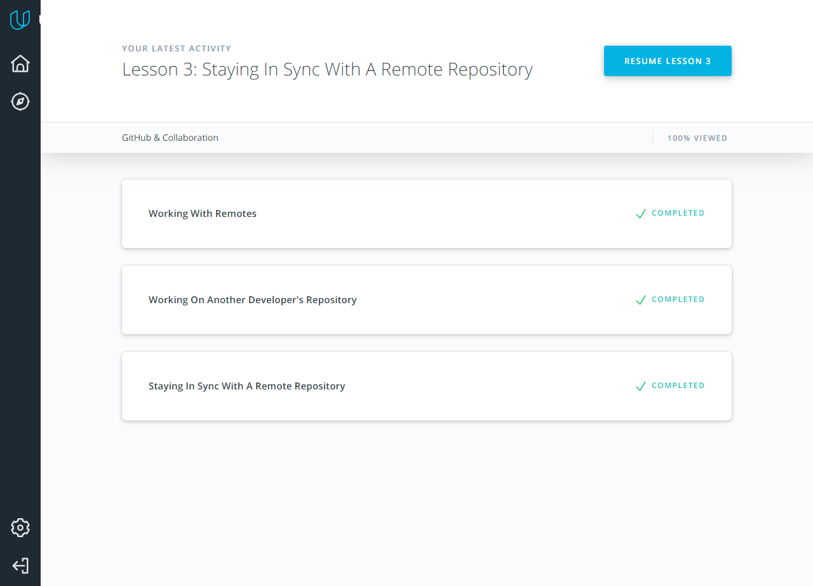
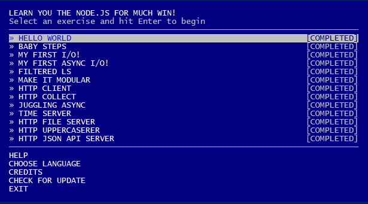
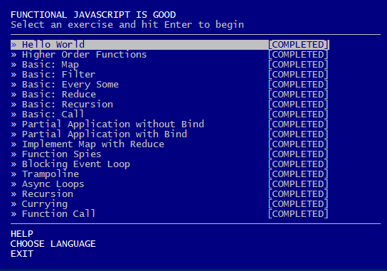

Though I was familiar with most of the material it was still very interesting to review it. I especially enjoyed the udacity git course.

## Unix shell

Making interactive tutorials was fun, but I knew already most of it's contents. Linuxcommand was actually much more fun. Especially I liked how a guy called Windows "legacy operating system" and "the other operating system" as if it was Lord Voldemort and you can't say its name.\
And I was also familiar with, but again amused by a weird way the bash shell defines function: with brackets just as a useless sintax marker and passing arguments as command line arguments. I am shure, there's a very good reason to make it like this, but it turnes reading function arguments into a tricky business.

## Git Collaboration

I was quite unfamilliar with forking and making pull requests, because I used git mostly for my own individual work. Also git rebase looks like a very powerfull tool which needs more looking into.

## NodeJS Basics 1

I was completely new to Node.js streaming and libraries, because used javascript before for frontend programming only. But the thing I was mostly impressed was the 'trampoline' template for a recursion. Recursion is a very powerfull conception, which really permits to solve some problems in a simple and elegant way, but it requires a lot of hardware resources for a stack of calls. The 'trampoline' thing removes that problem completely and I am absolutely intending to use it in future.